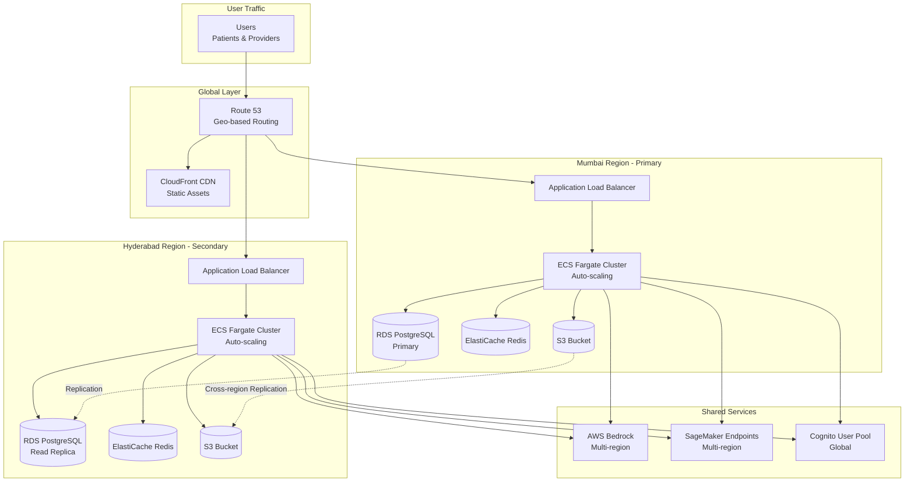

# Design Document: SwastSetu AI Health Copilot

## Overview

### System Purpose

SwastSetu AI is a dual-mode AI-powered healthcare platform designed to bridge the healthcare gap in rural and underserved populations across India. The system addresses critical challenges including extreme doctor-patient ratios (1:1000+), language barriers across 22+ Indian languages, and limited internet access in rural areas.

### Design Philosophy

The design is built on three core principles:

1. **Safety-First Architecture**: A 5-layer safety system ensures no AI-generated diagnoses or prescriptions reach patients directly, with mandatory human oversight for all clinical decisions.

2. **Accessibility-First Design**: Voice-first interfaces requiring no digital literacy, multilingual support for 22+ Indian languages, and operation over basic 2G networks ensure universal access.

3. **Human-in-the-Loop AI**: All AI outputs are assistive rather than autonomous, with confidence gating, human escalation, and explicit doctor approval for clinical decisions.

### System Modes

**Mode A: Patient-Facing Health Risk Navigator**
- Toll-free IVR-based voice interface accessible from any phone
- Multilingual symptom assessment in 22+ Indian languages
- AI-driven risk classification (Low, Moderate, High urgency)
- Safety guardrails preventing diagnosis/prescription disclosure
- Emergency escalation for high-risk cases

**Mode B: Doctor-Facing Clinical Intelligence Cockpit**
- Prioritized triage queue ordered by risk level
- AI-generated SOAP notes reducing documentation time by 70%
- Longitudinal patient history across all visits
- OCR-based lab report digitization
- Document QA for querying medical records
- AI clinical suggestion engine with explainability
- ABDM integration for national health record sync


## Architecture

### High-Level Architecture

The system follows a microservices architecture deployed on AWS cloud infrastructure with the following layers:

```mermaid
graph TB
    subgraph "Patient Access Layer"
        IVR[IVR Service<br/>Toll-Free Phone]
        Mobile[Mobile App<br/>Optional]
    end
    
    subgraph "Provider Access Layer"
        WebApp[Web Application<br/>Mode B]
        MobileApp[Mobile App<br/>Mode B]
    end
    
    subgraph "API Gateway Layer"
        APIGateway[AWS API Gateway<br/>Authentication & Rate Limiting]
    end
    
    subgraph "Application Services Layer"
        VoiceService[Voice Processing Service<br/>Whisper ASR]
        TranslationService[Translation Service<br/>IndicTrans2]
        SymptomService[Symptom Assessment Service<br/>NLP + Medical Ontology]
        RiskService[Risk Classification Service<br/>ML Model + Confidence Scoring]
        SafetyService[Safety Guardrail Service<br/>Content Filtering]
        TriageService[Triage Queue Service<br/>Real-time Prioritization]
        SOAPService[SOAP Generation Service<br/>Clinical Note AI]
        OCRService[OCR Service<br/>Lab Report Processing]
        DocumentQA[Document QA Service<br/>RAG Architecture]
        SuggestionService[Clinical Suggestion Service<br/>Differential Diagnosis AI]
        NotificationService[Notification Service<br/>Emergency Alerts]
    end
    
    subgraph "AI/ML Layer"
        Bedrock[AWS Bedrock<br/>Foundation Models]
        CustomModels[Custom ML Models<br/>SageMaker]
        VectorDB[Vector Database<br/>OpenSearch]
    end
    
    subgraph "Data Layer"
        PostgreSQL[(PostgreSQL<br/>Patient Records)]
        MongoDB[(MongoDB<br/>Unstructured Data)]
        S3[(S3<br/>Documents & Audio)]
        Redis[(Redis<br/>Cache & Sessions)]
    end
    
    subgraph "Integration Layer"
        ABDM[ABDM Integration<br/>Health Record Sync]
        Telecom[Telecom Gateway<br/>IVR Provider]
    end
    
    subgraph "Observability Layer"
        Monitoring[CloudWatch<br/>Metrics & Logs]
        BiasMonitor[Bias Monitoring<br/>Fairness Analytics]
        AuditLog[Audit Logging<br/>Compliance Tracking]
    end
    
    IVR --> APIGateway
    Mobile --> APIGateway
    WebApp --> APIGateway
    MobileApp --> APIGateway
    
    APIGateway --> VoiceService
    APIGateway --> TranslationService
    APIGateway --> SymptomService
    APIGateway --> RiskService
    APIGateway --> TriageService
    APIGateway --> SOAPService
    APIGateway --> OCRService
    APIGateway --> DocumentQA
    APIGateway --> SuggestionService
    
    VoiceService --> Bedrock
    TranslationService --> CustomModels
    SymptomService --> Bedrock
    RiskService --> CustomModels
    SafetyService --> Bedrock
    SOAPService --> Bedrock
    OCRService --> Bedrock
    DocumentQA --> VectorDB
    SuggestionService --> Bedrock
    
    RiskService --> SafetyService
    RiskService --> NotificationService
    
    VoiceService --> S3
    OCRService --> S3
    
    SymptomService --> PostgreSQL
    TriageService --> PostgreSQL
    TriageService --> Redis
    SOAPService --> PostgreSQL
    DocumentQA --> MongoDB
    
    NotificationService --> Telecom
    SOAPService --> ABDM
    
    VoiceService --> Monitoring
    RiskService --> BiasMonitor
    SafetyService --> AuditLog
```




### Technology Stack

**Frontend Technologies:**
- **Mode A (Patient)**: IVR system using Twilio/Exotel for Indian telecom integration
- **Mode B (Provider)**: React.js with TypeScript for web application, React Native for mobile app
- **UI Framework**: Material-UI with custom healthcare-focused components
- **State Management**: Redux Toolkit with RTK Query for API integration
- **Offline Support**: IndexedDB for local data caching, service workers for PWA capabilities

**Backend Technologies:**
- **API Layer**: Node.js with Express.js for high-concurrency handling
- **Microservices**: Python FastAPI for AI/ML services (better ML library ecosystem)
- **Authentication**: AWS Cognito with multi-factor authentication
- **API Gateway**: AWS API Gateway with rate limiting and request validation
- **Message Queue**: AWS SQS for asynchronous processing, SNS for pub/sub notifications

**AI/ML Technologies:**
- **Foundation Models**: AWS Bedrock (Claude 3.5 Sonnet for reasoning, Titan for embeddings)
- **Speech Recognition**: OpenAI Whisper (large-v3 model) fine-tuned for Indian accents
- **Translation**: IndicTrans2 (AI4Bharat) for Indian language translation
- **Custom ML Models**: 
  - Risk Classification: XGBoost ensemble with SHAP explainability
  - Symptom NER: BioBERT fine-tuned on Indian medical terminology
  - OCR: AWS Textract with custom post-processing for Indian lab formats
- **Vector Database**: AWS OpenSearch with k-NN plugin for document QA
- **Model Training**: AWS SageMaker for custom model training and deployment

**Data Storage:**
- **Relational Database**: Amazon RDS PostgreSQL 15 with Multi-AZ deployment
  - Patient demographics, visit records, SOAP notes, triage queue
- **Document Store**: Amazon DocumentDB (MongoDB-compatible) for unstructured data
  - Lab reports, medical documents, conversation transcripts
- **Object Storage**: Amazon S3 with lifecycle policies
  - Audio recordings, scanned documents, model artifacts
- **Cache Layer**: Amazon ElastiCache (Redis) for session management and real-time data
- **Data Warehouse**: Amazon Redshift for analytics and reporting

**Infrastructure:**
- **Cloud Provider**: AWS (Mumbai and Hyderabad regions for data residency)
- **Container Orchestration**: Amazon ECS with Fargate for serverless containers
- **Load Balancing**: Application Load Balancer with health checks
- **CDN**: Amazon CloudFront for static asset delivery
- **DNS**: Amazon Route 53 with health-based routing
- **Secrets Management**: AWS Secrets Manager with automatic rotation
- **Encryption**: AWS KMS for key management, CloudHSM for PII encryption

**Observability & Security:**
- **Monitoring**: Amazon CloudWatch with custom metrics and dashboards
- **Logging**: CloudWatch Logs with structured JSON logging
- **Tracing**: AWS X-Ray for distributed tracing
- **Security**: AWS WAF, AWS Shield for DDoS protection, GuardDuty for threat detection
- **Compliance**: AWS Config for compliance monitoring, CloudTrail for audit logging
- **Bias Monitoring**: Custom Python service using Fairlearn and AIF360 libraries

**Integration:**
- **ABDM**: REST API integration with OAuth 2.0 authentication
- **Telecom**: Twilio/Exotel SDK for IVR, SMS, and voice calls
- **Payment**: (Future) Razorpay/Paytm for consultation fees


### Deployment Architecture

**Multi-Region Active-Active Deployment:**



**Scaling Strategy:**
- **Horizontal Scaling**: ECS services auto-scale based on CPU (>70%) and memory (>80%) utilization
- **Database Scaling**: Read replicas for read-heavy workloads, connection pooling with PgBouncer
- **Cache Scaling**: Redis cluster mode for distributed caching
- **AI Model Scaling**: SageMaker auto-scaling endpoints with minimum 2 instances per model
- **Peak Load Handling**: Pre-warming during known peak hours (8 AM - 12 PM, 6 PM - 9 PM IST)

**Disaster Recovery:**
- **RTO (Recovery Time Objective)**: 4 hours
- **RPO (Recovery Point Objective)**: 15 minutes
- **Backup Strategy**: 
  - Automated daily RDS snapshots with 30-day retention
  - Continuous S3 cross-region replication
  - Point-in-time recovery enabled for databases
- **Failover Strategy**: Automated DNS failover using Route 53 health checks


## Components and Interfaces

### Mode A: Patient-Facing Components

#### 1. IVR Service

**Responsibilities:**
- Handle incoming toll-free calls from patients
- Manage call flow and conversation state
- Integrate with Voice Processor and Translation Engine
- Provide DTMF fallback for voice recognition failures

**Key Interfaces:**

```typescript
interface IVRService {
  // Initiate new patient call
  handleIncomingCall(callSid: string, phoneNumber: string): Promise<CallSession>;
  
  // Process patient voice input
  processVoiceInput(callSid: string, audioUrl: string): Promise<TranscriptionResult>;
  
  // Send voice response to patient
  sendVoiceResponse(callSid: string, text: string, language: string): Promise<void>;
  
  // Handle DTMF input as fallback
  processDTMFInput(callSid: string, digits: string): Promise<void>;
  
  // End call and cleanup
  endCall(callSid: string): Promise<CallSummary>;
}

interface CallSession {
  sessionId: string;
  phoneNumber: string;
  language: string;
  conversationState: ConversationState;
  startTime: Date;
}

interface TranscriptionResult {
  text: string;
  confidence: number;
  language: string;
  duration: number;
}
```

**Technology:** Twilio/Exotel SDK, Node.js Express server

#### 2. Voice Processor

**Responsibilities:**
- Convert speech to text using Whisper ASR
- Handle multiple Indian accents and dialects
- Provide confidence scores for transcriptions
- Support audio quality variations

**Key Interfaces:**

```typescript
interface VoiceProcessor {
  // Transcribe audio to text
  transcribe(audioUrl: string, language: string): Promise<TranscriptionResult>;
  
  // Batch transcription for analytics
  batchTranscribe(audioUrls: string[], language: string): Promise<TranscriptionResult[]>;
  
  // Get supported languages
  getSupportedLanguages(): Promise<string[]>;
}
```

**Technology:** OpenAI Whisper (large-v3), Python FastAPI, AWS S3 for audio storage

#### 3. Translation Engine

**Responsibilities:**
- Translate between English and 22+ Indian languages
- Maintain medical terminology accuracy
- Provide translation confidence scores
- Support bidirectional translation

**Key Interfaces:**

```typescript
interface TranslationEngine {
  // Translate text between languages
  translate(text: string, sourceLang: string, targetLang: string): Promise<TranslationResult>;
  
  // Batch translation for efficiency
  batchTranslate(texts: string[], sourceLang: string, targetLang: string): Promise<TranslationResult[]>;
  
  // Validate medical term translation
  validateMedicalTranslation(text: string, sourceLang: string, targetLang: string): Promise<ValidationResult>;
}

interface TranslationResult {
  translatedText: string;
  confidence: number;
  sourceLang: string;
  targetLang: string;
  medicalTermsDetected: string[];
}
```

**Technology:** IndicTrans2 (AI4Bharat), Python FastAPI, custom medical terminology glossary

#### 4. Symptom Assessment Service

**Responsibilities:**
- Extract medical entities from patient descriptions
- Generate contextual follow-up questions
- Maintain conversation context
- Limit questions to prevent patient fatigue

**Key Interfaces:**

```typescript
interface SymptomAssessmentService {
  // Start new symptom assessment
  startAssessment(patientId: string, initialSymptoms: string): Promise<AssessmentSession>;
  
  // Process patient response and generate next question
  processResponse(sessionId: string, response: string): Promise<AssessmentStep>;
  
  // Complete assessment and return structured data
  completeAssessment(sessionId: string): Promise<SymptomData>;
  
  // Get assessment progress
  getProgress(sessionId: string): Promise<AssessmentProgress>;
}

interface AssessmentSession {
  sessionId: string;
  patientId: string;
  startTime: Date;
  extractedSymptoms: MedicalEntity[];
  conversationHistory: ConversationTurn[];
}

interface AssessmentStep {
  nextQuestion: string;
  questionType: 'duration' | 'severity' | 'associated' | 'clarification';
  isComplete: boolean;
  questionsAsked: number;
  maxQuestions: number;
}

interface SymptomData {
  primarySymptoms: MedicalEntity[];
  associatedSymptoms: MedicalEntity[];
  duration: string;
  severity: 'mild' | 'moderate' | 'severe';
  patientHistory: string[];
  redFlags: string[];
}

interface MedicalEntity {
  text: string;
  type: 'symptom' | 'condition' | 'medication' | 'body_part';
  confidence: number;
  normalizedTerm: string;
}
```

**Technology:** BioBERT for NER, AWS Bedrock (Claude) for question generation, PostgreSQL for session storage


#### 5. Risk Classification Service

**Responsibilities:**
- Classify patient cases as Low, Moderate, or High urgency
- Provide confidence scores and explainability
- Trigger emergency escalation for high-risk cases
- Implement confidence gating (<60% requires human review)

**Key Interfaces:**

```typescript
interface RiskClassificationService {
  // Classify patient risk level
  classifyRisk(symptomData: SymptomData, patientContext: PatientContext): Promise<RiskClassification>;
  
  // Get explanation for classification
  explainClassification(classificationId: string): Promise<Explanation>;
  
  // Batch classification for analytics
  batchClassify(cases: SymptomData[]): Promise<RiskClassification[]>;
}

interface RiskClassification {
  classificationId: string;
  riskLevel: 'low' | 'moderate' | 'high';
  confidence: number;
  reasoning: string[];
  recommendedAction: string;
  careLevel: 'home_care' | 'phc_visit' | 'emergency';
  nearestFacility: FacilityInfo;
  requiresHumanReview: boolean;
  timestamp: Date;
}

interface PatientContext {
  age: number;
  gender: string;
  location: GeoLocation;
  medicalHistory: string[];
  currentMedications: string[];
  allergies: string[];
}

interface Explanation {
  topFactors: Array<{factor: string, importance: number}>;
  shapValues: Record<string, number>;
  similarCases: string[];
  guidelines: string[];
}
```

**Technology:** XGBoost ensemble model, SHAP for explainability, Python FastAPI, SageMaker for model hosting

#### 6. Safety Guardrail Service

**Responsibilities:**
- Block diagnoses, medication names, and prescriptions from patient-facing outputs
- Replace prohibited content with safe guidance
- Log all interventions for audit
- Provide emergency action guidance without diagnosis

**Key Interfaces:**

```typescript
interface SafetyGuardrailService {
  // Validate content before sending to patient
  validateContent(content: string, contentType: 'risk_message' | 'guidance' | 'general'): Promise<ValidationResult>;
  
  // Sanitize content by removing prohibited terms
  sanitizeContent(content: string): Promise<SanitizedContent>;
  
  // Check for emergency keywords
  detectEmergencyKeywords(symptoms: string[]): Promise<EmergencyDetection>;
}

interface ValidationResult {
  isValid: boolean;
  violations: Array<{type: string, text: string, position: number}>;
  sanitizedContent: string;
  interventionId: string;
}

interface SanitizedContent {
  originalContent: string;
  sanitizedContent: string;
  replacements: Array<{original: string, replacement: string}>;
  wasModified: boolean;
}

interface EmergencyDetection {
  isEmergency: boolean;
  keywords: string[];
  recommendedAction: string;
  urgencyLevel: number;
}
```

**Technology:** AWS Bedrock (Claude) with custom prompts, regex patterns for medical terms, PostgreSQL for audit logs


### Mode B: Provider-Facing Components

#### 7. Triage Queue Service

**Responsibilities:**
- Maintain prioritized patient queue ordered by risk level and wait time
- Send real-time notifications for high-urgency cases
- Update queue status as doctors handle cases
- Support filtering and search

**Key Interfaces:**

```typescript
interface TriageQueueService {
  // Add patient to triage queue
  addToQueue(patientId: string, riskClassification: RiskClassification): Promise<QueueEntry>;
  
  // Get current queue for a facility
  getQueue(facilityId: string, filters?: QueueFilters): Promise<QueueEntry[]>;
  
  // Assign patient to doctor
  assignPatient(queueEntryId: string, doctorId: string): Promise<void>;
  
  // Update queue entry status
  updateStatus(queueEntryId: string, status: QueueStatus): Promise<void>;
  
  // Send notification for high-urgency case
  notifyHighUrgency(queueEntryId: string): Promise<void>;
  
  // Get queue statistics
  getQueueStats(facilityId: string): Promise<QueueStatistics>;
}

interface QueueEntry {
  id: string;
  patientId: string;
  patientName: string;
  age: number;
  primarySymptoms: string[];
  riskLevel: 'low' | 'moderate' | 'high';
  confidence: number;
  waitTime: number; // minutes
  addedAt: Date;
  status: QueueStatus;
  assignedDoctorId?: string;
}

type QueueStatus = 'waiting' | 'in_progress' | 'completed' | 'escalated';

interface QueueFilters {
  riskLevel?: 'low' | 'moderate' | 'high';
  minWaitTime?: number;
  assignedToMe?: boolean;
}

interface QueueStatistics {
  totalWaiting: number;
  highUrgency: number;
  moderateUrgency: number;
  lowUrgency: number;
  averageWaitTime: number;
  longestWaitTime: number;
}
```

**Technology:** Redis for real-time queue management, PostgreSQL for persistence, WebSocket for real-time updates

#### 8. SOAP Generation Service

**Responsibilities:**
- Generate structured SOAP notes from consultation data
- Populate Subjective section from patient symptoms
- Allow doctor input for Objective section
- Suggest Assessment and Plan with AI
- Support doctor editing and approval

**Key Interfaces:**

```typescript
interface SOAPGenerationService {
  // Generate initial SOAP note draft
  generateSOAPNote(consultationData: ConsultationData): Promise<SOAPNote>;
  
  // Update SOAP note with doctor edits
  updateSOAPNote(noteId: string, updates: Partial<SOAPNote>): Promise<SOAPNote>;
  
  // Approve and finalize SOAP note
  approveSOAPNote(noteId: string, doctorId: string): Promise<FinalizedSOAPNote>;
  
  // Get SOAP note history for patient
  getSOAPHistory(patientId: string): Promise<SOAPNote[]>;
}

interface ConsultationData {
  patientId: string;
  symptomData: SymptomData;
  vitalSigns?: VitalSigns;
  examinationFindings?: string;
  doctorNotes?: string;
}

interface SOAPNote {
  id: string;
  patientId: string;
  consultationDate: Date;
  subjective: SubjectiveSection;
  objective: ObjectiveSection;
  assessment: AssessmentSection;
  plan: PlanSection;
  status: 'draft' | 'approved' | 'finalized';
  aiGenerated: {
    subjective: boolean;
    assessment: boolean;
    plan: boolean;
  };
  doctorId?: string;
  approvedAt?: Date;
}

interface SubjectiveSection {
  chiefComplaint: string;
  historyOfPresentIllness: string;
  reviewOfSystems: string[];
  pastMedicalHistory: string[];
  medications: string[];
  allergies: string[];
}

interface ObjectiveSection {
  vitalSigns: VitalSigns;
  physicalExamination: string;
  labResults?: LabResult[];
}

interface AssessmentSection {
  differentialDiagnoses: Array<{diagnosis: string, confidence: number, reasoning: string}>;
  workingDiagnosis?: string;
  aiSuggestions: string[];
}

interface PlanSection {
  medications: Array<{name: string, dosage: string, duration: string}>;
  tests: string[];
  referrals: string[];
  followUp: string;
  patientEducation: string;
  aiSuggestions: string[];
}

interface VitalSigns {
  temperature?: number;
  bloodPressure?: {systolic: number, diastolic: number};
  heartRate?: number;
  respiratoryRate?: number;
  oxygenSaturation?: number;
  weight?: number;
  height?: number;
}
```

**Technology:** AWS Bedrock (Claude) for note generation, PostgreSQL for storage, React for editing interface


#### 9. OCR Service

**Responsibilities:**
- Extract text from lab report images
- Structure lab values with test name, result, unit, reference range
- Flag abnormal values
- Support common Indian lab report formats
- Require manual verification for low-confidence extractions

**Key Interfaces:**

```typescript
interface OCRService {
  // Process lab report image
  processLabReport(imageUrl: string, patientId: string): Promise<LabReportResult>;
  
  // Batch process multiple reports
  batchProcessReports(imageUrls: string[], patientId: string): Promise<LabReportResult[]>;
  
  // Verify and correct OCR results
  verifyLabReport(reportId: string, corrections: LabValueCorrection[]): Promise<LabReportResult>;
  
  // Get supported lab formats
  getSupportedFormats(): Promise<LabFormat[]>;
}

interface LabReportResult {
  reportId: string;
  patientId: string;
  reportDate: Date;
  labName: string;
  labValues: LabValue[];
  rawText: string;
  confidence: number;
  requiresVerification: boolean;
  summary: string;
  abnormalFlags: string[];
}

interface LabValue {
  testName: string;
  result: string;
  unit: string;
  referenceRange: string;
  isAbnormal: boolean;
  confidence: number;
  position: {x: number, y: number, width: number, height: number};
}

interface LabValueCorrection {
  testName: string;
  correctedResult: string;
  correctedUnit?: string;
}

interface LabFormat {
  labName: string;
  formatId: string;
  supportedTests: string[];
}
```

**Technology:** AWS Textract for OCR, custom Python post-processing, AWS Bedrock for summarization, S3 for image storage

#### 10. Document QA Service

**Responsibilities:**
- Answer natural language questions about patient medical records
- Search across all patient documents
- Cite source documents and dates
- Support English and Hindi queries
- Provide confidence scores

**Key Interfaces:**

```typescript
interface DocumentQAService {
  // Ask question about patient records
  askQuestion(patientId: string, question: string, language: string): Promise<QAResponse>;
  
  // Get conversation history
  getConversationHistory(patientId: string, sessionId: string): Promise<QAConversation>;
  
  // Index new documents for patient
  indexDocuments(patientId: string, documents: Document[]): Promise<void>;
  
  // Search documents by keyword
  searchDocuments(patientId: string, query: string): Promise<DocumentSearchResult[]>;
}

interface QAResponse {
  answer: string;
  confidence: number;
  sources: Array<{
    documentId: string;
    documentType: string;
    date: Date;
    excerpt: string;
    relevanceScore: number;
  }>;
  relatedQuestions: string[];
  responseTime: number;
}

interface QAConversation {
  sessionId: string;
  patientId: string;
  turns: Array<{
    question: string;
    answer: string;
    timestamp: Date;
  }>;
}

interface Document {
  documentId: string;
  type: 'soap_note' | 'lab_report' | 'prescription' | 'referral' | 'other';
  content: string;
  metadata: Record<string, any>;
  date: Date;
}

interface DocumentSearchResult {
  documentId: string;
  type: string;
  date: Date;
  snippet: string;
  relevanceScore: number;
}
```

**Technology:** AWS OpenSearch with k-NN, AWS Bedrock (Claude) for QA, Titan embeddings for vector search, MongoDB for document storage


#### 11. Clinical Suggestion Service

**Responsibilities:**
- Generate differential diagnosis suggestions
- Suggest treatment options (medications, tests, referrals)
- Provide evidence-based reasoning with guideline references
- Clearly label all suggestions as AI-generated
- Allow doctor approval/rejection with feedback

**Key Interfaces:**

```typescript
interface ClinicalSuggestionService {
  // Generate differential diagnosis suggestions
  generateDifferentialDiagnosis(symptomData: SymptomData, patientContext: PatientContext): Promise<DifferentialDiagnosis>;
  
  // Generate treatment suggestions
  generateTreatmentSuggestions(diagnosis: string, patientContext: PatientContext): Promise<TreatmentSuggestions>;
  
  // Record doctor feedback on suggestions
  recordFeedback(suggestionId: string, feedback: SuggestionFeedback): Promise<void>;
  
  // Get suggestion history for analytics
  getSuggestionHistory(filters: SuggestionFilters): Promise<SuggestionHistoryEntry[]>;
}

interface DifferentialDiagnosis {
  suggestionId: string;
  diagnoses: Array<{
    condition: string;
    probability: number;
    supportingEvidence: string[];
    contradictingEvidence: string[];
    guidelines: GuidelineReference[];
    nextSteps: string[];
  }>;
  confidence: number;
  generatedAt: Date;
}

interface TreatmentSuggestions {
  suggestionId: string;
  medications: Array<{
    name: string;
    dosage: string;
    duration: string;
    indication: string;
    contraindications: string[];
    alternatives: string[];
    guidelines: GuidelineReference[];
  }>;
  tests: Array<{
    testName: string;
    indication: string;
    urgency: 'routine' | 'urgent' | 'stat';
    expectedFindings: string[];
  }>;
  referrals: Array<{
    specialty: string;
    indication: string;
    urgency: 'routine' | 'urgent';
  }>;
  lifestyle: string[];
  followUp: string;
  confidence: number;
  generatedAt: Date;
}

interface GuidelineReference {
  title: string;
  source: string;
  url?: string;
  relevantSection: string;
}

interface SuggestionFeedback {
  suggestionId: string;
  doctorId: string;
  action: 'accepted' | 'modified' | 'rejected';
  modifications?: string;
  rejectionReason?: string;
  timestamp: Date;
}

interface SuggestionFilters {
  startDate?: Date;
  endDate?: Date;
  doctorId?: string;
  action?: 'accepted' | 'modified' | 'rejected';
}

interface SuggestionHistoryEntry {
  suggestionId: string;
  type: 'differential' | 'treatment';
  patientId: string;
  doctorId: string;
  feedback: SuggestionFeedback;
  timestamp: Date;
}
```

**Technology:** AWS Bedrock (Claude) with medical knowledge base, PubMed API for guidelines, PostgreSQL for feedback storage

#### 12. Emergency Escalation Service

**Responsibilities:**
- Send alerts for high-risk cases within 30 seconds
- Notify PHC, district health officer, and emergency services
- Track acknowledgment from recipients
- Escalate to next level if no acknowledgment in 5 minutes
- Maintain dashboard of active emergency cases

**Key Interfaces:**

```typescript
interface EmergencyEscalationService {
  // Trigger emergency escalation
  triggerEscalation(escalation: EmergencyEscalation): Promise<EscalationResult>;
  
  // Record acknowledgment from recipient
  recordAcknowledgment(escalationId: string, recipientId: string): Promise<void>;
  
  // Get active emergency cases
  getActiveEmergencies(facilityId?: string): Promise<EmergencyCase[]>;
  
  // Update emergency case status
  updateEmergencyStatus(escalationId: string, status: EmergencyStatus): Promise<void>;
  
  // Get escalation history
  getEscalationHistory(patientId: string): Promise<EscalationHistoryEntry[]>;
}

interface EmergencyEscalation {
  patientId: string;
  patientName: string;
  age: number;
  gender: string;
  location: GeoLocation;
  contactNumber: string;
  symptoms: string[];
  riskClassification: RiskClassification;
  nearestPHC: FacilityInfo;
  districtHealthOfficer: ContactInfo;
}

interface EscalationResult {
  escalationId: string;
  notificationsSent: Array<{
    recipientType: 'phc' | 'district_officer' | 'emergency_services';
    recipientId: string;
    channel: 'sms' | 'phone' | 'app';
    status: 'sent' | 'failed';
    sentAt: Date;
  }>;
  escalationLevel: number;
  nextEscalationAt?: Date;
}

interface EmergencyCase {
  escalationId: string;
  patientId: string;
  patientName: string;
  symptoms: string[];
  location: GeoLocation;
  status: EmergencyStatus;
  acknowledgedBy: string[];
  createdAt: Date;
  resolvedAt?: Date;
}

type EmergencyStatus = 'active' | 'acknowledged' | 'in_transit' | 'resolved' | 'escalated';

interface EscalationHistoryEntry {
  escalationId: string;
  patientId: string;
  triggeredAt: Date;
  acknowledgedAt?: Date;
  resolvedAt?: Date;
  outcome: string;
}

interface GeoLocation {
  latitude: number;
  longitude: number;
  address: string;
  district: string;
  state: string;
}

interface FacilityInfo {
  facilityId: string;
  name: string;
  type: 'phc' | 'chc' | 'hospital';
  location: GeoLocation;
  contactNumber: string;
  distance: number; // km
  estimatedTravelTime: number; // minutes
}

interface ContactInfo {
  name: string;
  role: string;
  phoneNumber: string;
  email: string;
}
```

**Technology:** AWS SNS for notifications, Twilio for SMS/calls, WebSocket for real-time dashboard, PostgreSQL for tracking


#### 13. ABDM Integration Service

**Responsibilities:**
- Retrieve patient health records from ABDM using health ID
- Upload consultation data to ABDM after completion
- Support ABDM-compliant data formats (FHIR)
- Handle sync failures with retry queue
- Maintain audit logs for compliance

**Key Interfaces:**

```typescript
interface ABDMIntegrationService {
  // Retrieve patient records from ABDM
  fetchPatientRecords(healthId: string): Promise<ABDMHealthRecord>;
  
  // Upload consultation to ABDM
  uploadConsultation(consultation: ConsultationRecord): Promise<ABDMUploadResult>;
  
  // Check ABDM sync status
  getSyncStatus(consultationId: string): Promise<SyncStatus>;
  
  // Retry failed syncs
  retryFailedSync(consultationId: string): Promise<ABDMUploadResult>;
  
  // Get sync statistics
  getSyncStatistics(facilityId: string, dateRange: DateRange): Promise<SyncStatistics>;
}

interface ABDMHealthRecord {
  healthId: string;
  patientDemographics: PatientDemographics;
  consultations: FHIREncounter[];
  labReports: FHIRDiagnosticReport[];
  prescriptions: FHIRMedicationRequest[];
  immunizations: FHIRImmunization[];
  lastUpdated: Date;
}

interface ConsultationRecord {
  consultationId: string;
  patientHealthId: string;
  facilityId: string;
  doctorId: string;
  consultationDate: Date;
  soapNote: SOAPNote;
  prescriptions: Prescription[];
  labOrders: LabOrder[];
  followUp?: FollowUpPlan;
}

interface ABDMUploadResult {
  success: boolean;
  abdmRecordId?: string;
  errorMessage?: string;
  uploadedAt?: Date;
  retryCount: number;
}

interface SyncStatus {
  consultationId: string;
  status: 'pending' | 'in_progress' | 'completed' | 'failed';
  lastAttempt?: Date;
  nextRetry?: Date;
  errorMessage?: string;
}

interface SyncStatistics {
  totalConsultations: number;
  successfulSyncs: number;
  failedSyncs: number;
  pendingSyncs: number;
  averageSyncTime: number;
  syncSuccessRate: number;
}

interface DateRange {
  startDate: Date;
  endDate: Date;
}

// FHIR resource types (simplified)
interface FHIREncounter {
  resourceType: 'Encounter';
  id: string;
  status: string;
  class: string;
  subject: {reference: string};
  period: {start: Date, end: Date};
  reasonCode: Array<{coding: Array<{system: string, code: string, display: string}>}>;
}

interface FHIRDiagnosticReport {
  resourceType: 'DiagnosticReport';
  id: string;
  status: string;
  code: {coding: Array<{system: string, code: string, display: string}>};
  subject: {reference: string};
  result: Array<{reference: string}>;
}

interface FHIRMedicationRequest {
  resourceType: 'MedicationRequest';
  id: string;
  status: string;
  intent: string;
  medicationCodeableConcept: {coding: Array<{system: string, code: string, display: string}>};
  subject: {reference: string};
  dosageInstruction: Array<{text: string}>;
}

interface FHIRImmunization {
  resourceType: 'Immunization';
  id: string;
  status: string;
  vaccineCode: {coding: Array<{system: string, code: string, display: string}>};
  patient: {reference: string};
  occurrenceDateTime: Date;
}
```

**Technology:** FHIR library for data transformation, REST API client for ABDM, AWS SQS for retry queue, PostgreSQL for sync tracking


### Cross-Cutting Components

#### 14. Authentication & Authorization Service

**Responsibilities:**
- Multi-factor authentication for Mode B users
- Role-based access control (doctors, nurses, administrators, health officers)
- Session management with automatic timeout
- Integration with hospital authentication systems

**Key Interfaces:**

```typescript
interface AuthenticationService {
  // Authenticate user with credentials
  authenticate(username: string, password: string): Promise<AuthenticationResult>;
  
  // Verify MFA code
  verifyMFA(userId: string, code: string): Promise<MFAVerificationResult>;
  
  // Refresh access token
  refreshToken(refreshToken: string): Promise<TokenPair>;
  
  // Logout and invalidate session
  logout(userId: string, sessionId: string): Promise<void>;
  
  // Check user permissions
  checkPermission(userId: string, resource: string, action: string): Promise<boolean>;
}

interface AuthenticationResult {
  success: boolean;
  userId?: string;
  requiresMFA: boolean;
  sessionId?: string;
  errorMessage?: string;
}

interface MFAVerificationResult {
  success: boolean;
  tokens?: TokenPair;
  errorMessage?: string;
}

interface TokenPair {
  accessToken: string;
  refreshToken: string;
  expiresIn: number;
}

interface AuthorizationService {
  // Get user roles
  getUserRoles(userId: string): Promise<Role[]>;
  
  // Check if user has permission
  hasPermission(userId: string, permission: Permission): Promise<boolean>;
  
  // Get user permissions
  getUserPermissions(userId: string): Promise<Permission[]>;
}

interface Role {
  roleId: string;
  name: 'doctor' | 'nurse' | 'administrator' | 'district_officer' | 'lab_technician';
  permissions: Permission[];
}

interface Permission {
  resource: string;
  actions: Array<'read' | 'write' | 'delete' | 'approve'>;
}
```

**Technology:** AWS Cognito for user management, JWT for tokens, Redis for session storage

#### 15. Audit Logging Service

**Responsibilities:**
- Log all patient data access with timestamp, user, and purpose
- Log AI-generated outputs and human modifications
- Log safety guardrail interventions
- Maintain tamper-proof logs for 7 years
- Support compliance reporting and audit searches

**Key Interfaces:**

```typescript
interface AuditLoggingService {
  // Log data access event
  logDataAccess(event: DataAccessEvent): Promise<void>;
  
  // Log AI output event
  logAIOutput(event: AIOutputEvent): Promise<void>;
  
  // Log safety intervention
  logSafetyIntervention(event: SafetyInterventionEvent): Promise<void>;
  
  // Search audit logs
  searchLogs(query: AuditQuery): Promise<AuditLogEntry[]>;
  
  // Generate compliance report
  generateComplianceReport(reportType: string, dateRange: DateRange): Promise<ComplianceReport>;
  
  // Detect suspicious access patterns
  detectSuspiciousActivity(): Promise<SuspiciousActivityAlert[]>;
}

interface DataAccessEvent {
  userId: string;
  userRole: string;
  patientId: string;
  resourceType: string;
  resourceId: string;
  action: 'read' | 'write' | 'delete';
  purpose: string;
  ipAddress: string;
  timestamp: Date;
}

interface AIOutputEvent {
  modelName: string;
  modelVersion: string;
  inputData: any;
  outputData: any;
  confidence: number;
  humanModified: boolean;
  modifications?: string;
  approvedBy?: string;
  timestamp: Date;
}

interface SafetyInterventionEvent {
  interventionType: 'diagnosis_blocked' | 'medication_blocked' | 'prescription_blocked';
  originalContent: string;
  sanitizedContent: string;
  patientId: string;
  context: string;
  timestamp: Date;
}

interface AuditQuery {
  userId?: string;
  patientId?: string;
  resourceType?: string;
  action?: string;
  startDate?: Date;
  endDate?: Date;
  limit?: number;
}

interface AuditLogEntry {
  logId: string;
  eventType: string;
  details: any;
  timestamp: Date;
  hash: string; // for tamper detection
}

interface ComplianceReport {
  reportType: string;
  dateRange: DateRange;
  totalEvents: number;
  eventsByType: Record<string, number>;
  violations: any[];
  generatedAt: Date;
}

interface SuspiciousActivityAlert {
  alertId: string;
  userId: string;
  pattern: string;
  severity: 'low' | 'medium' | 'high';
  events: AuditLogEntry[];
  detectedAt: Date;
}
```

**Technology:** AWS CloudWatch Logs with log retention, PostgreSQL for structured audit data, AWS Lambda for suspicious activity detection


#### 16. Bias Monitoring Service

**Responsibilities:**
- Track AI outputs across demographic dimensions
- Generate monthly fairness reports
- Alert on statistical bias (>10% disparity)
- Track emergency escalation rates across demographics
- Support quarterly fairness audits

**Key Interfaces:**

```typescript
interface BiasMonitoringService {
  // Record AI decision with demographic context
  recordDecision(decision: AIDecision, demographics: Demographics): Promise<void>;
  
  // Generate fairness report
  generateFairnessReport(dateRange: DateRange): Promise<FairnessReport>;
  
  // Check for bias in real-time
  checkForBias(metric: string, demographics: Demographics): Promise<BiasCheckResult>;
  
  // Get bias alerts
  getBiasAlerts(severity?: 'low' | 'medium' | 'high'): Promise<BiasAlert[]>;
  
  // Record corrective action
  recordCorrectiveAction(alertId: string, action: CorrectiveAction): Promise<void>;
}

interface AIDecision {
  decisionId: string;
  decisionType: 'risk_classification' | 'diagnosis_suggestion' | 'treatment_suggestion';
  outcome: any;
  confidence: number;
  timestamp: Date;
}

interface Demographics {
  gender: 'male' | 'female' | 'other';
  ageGroup: '18-30' | '31-50' | '51-70' | '70+';
  language: string;
  location: {
    state: string;
    district: string;
    urban: boolean;
  };
}

interface FairnessReport {
  reportId: string;
  dateRange: DateRange;
  metrics: {
    riskClassificationByGender: Record<string, number>;
    riskClassificationByAge: Record<string, number>;
    riskClassificationByLanguage: Record<string, number>;
    riskClassificationByLocation: Record<string, number>;
    emergencyEscalationByGender: Record<string, number>;
    emergencyEscalationByAge: Record<string, number>;
    confidenceScoreByGender: Record<string, number>;
    confidenceScoreByAge: Record<string, number>;
  };
  disparities: Array<{
    metric: string;
    groups: string[];
    disparity: number;
    severity: 'low' | 'medium' | 'high';
  }>;
  generatedAt: Date;
}

interface BiasCheckResult {
  hasBias: boolean;
  disparity: number;
  threshold: number;
  affectedGroups: string[];
  recommendation: string;
}

interface BiasAlert {
  alertId: string;
  metric: string;
  disparity: number;
  affectedGroups: string[];
  severity: 'low' | 'medium' | 'high';
  detectedAt: Date;
  status: 'open' | 'investigating' | 'resolved';
  correctiveAction?: CorrectiveAction;
}

interface CorrectiveAction {
  actionType: 'data_augmentation' | 'model_retraining' | 'threshold_adjustment' | 'manual_review';
  description: string;
  implementedBy: string;
  implementedAt: Date;
  validationResults?: any;
}
```

**Technology:** Python with Fairlearn and AIF360 libraries, PostgreSQL for metrics storage, AWS Lambda for scheduled bias checks


## Data Models

### Core Domain Models

#### Patient

```typescript
interface Patient {
  patientId: string; // UUID
  healthId?: string; // ABDM Health ID
  demographics: PatientDemographics;
  contactInfo: ContactInfo;
  medicalHistory: MedicalHistory;
  createdAt: Date;
  updatedAt: Date;
  consentStatus: ConsentStatus;
}

interface PatientDemographics {
  firstName: string;
  lastName: string;
  dateOfBirth: Date;
  age: number;
  gender: 'male' | 'female' | 'other';
  language: string;
  location: GeoLocation;
}

interface ContactInfo {
  phoneNumber: string;
  alternatePhoneNumber?: string;
  email?: string;
  address: string;
  emergencyContact?: {
    name: string;
    relationship: string;
    phoneNumber: string;
  };
}

interface MedicalHistory {
  chronicConditions: string[];
  pastSurgeries: string[];
  allergies: string[];
  currentMedications: string[];
  familyHistory: string[];
  immunizations: string[];
  lastUpdated: Date;
}

interface ConsentStatus {
  dataCollectionConsent: boolean;
  aiProcessingConsent: boolean;
  abdmSharingConsent: boolean;
  researchConsent: boolean;
  consentDate: Date;
  consentVersion: string;
}
```

#### Consultation

```typescript
interface Consultation {
  consultationId: string; // UUID
  patientId: string;
  facilityId: string;
  doctorId?: string;
  consultationType: 'mode_a_assessment' | 'mode_b_consultation';
  consultationDate: Date;
  status: 'in_progress' | 'completed' | 'cancelled';
  
  // Mode A specific
  callSessionId?: string;
  symptomAssessment?: SymptomAssessment;
  riskClassification?: RiskClassification;
  
  // Mode B specific
  soapNote?: SOAPNote;
  prescriptions?: Prescription[];
  labOrders?: LabOrder[];
  referrals?: Referral[];
  followUp?: FollowUpPlan;
  
  // Common
  duration?: number; // minutes
  completedAt?: Date;
  abdmSyncStatus?: SyncStatus;
}

interface SymptomAssessment {
  sessionId: string;
  language: string;
  conversationTranscript: ConversationTurn[];
  extractedSymptoms: MedicalEntity[];
  symptomData: SymptomData;
  assessmentDuration: number; // seconds
  questionsAsked: number;
}

interface ConversationTurn {
  speaker: 'patient' | 'system';
  text: string;
  translatedText?: string;
  timestamp: Date;
  audioUrl?: string;
}

interface Prescription {
  prescriptionId: string;
  medicationName: string;
  dosage: string;
  frequency: string;
  duration: string;
  instructions: string;
  prescribedBy: string;
  prescribedAt: Date;
}

interface LabOrder {
  orderId: string;
  testName: string;
  indication: string;
  urgency: 'routine' | 'urgent' | 'stat';
  orderedBy: string;
  orderedAt: Date;
  status: 'ordered' | 'collected' | 'processing' | 'completed';
  result?: LabReportResult;
}

interface Referral {
  referralId: string;
  specialty: string;
  facilityName?: string;
  indication: string;
  urgency: 'routine' | 'urgent';
  referredBy: string;
  referredAt: Date;
  status: 'pending' | 'scheduled' | 'completed';
}

interface FollowUpPlan {
  followUpDate?: Date;
  followUpType: 'in_person' | 'phone' | 'telemedicine';
  instructions: string;
  monitoringParameters: string[];
}
```

#### Healthcare Provider

```typescript
interface HealthcareProvider {
  providerId: string; // UUID
  personalInfo: {
    firstName: string;
    lastName: string;
    dateOfBirth: Date;
    gender: string;
    phoneNumber: string;
    email: string;
  };
  credentials: {
    registrationNumber: string;
    registrationCouncil: string;
    qualifications: string[];
    specializations: string[];
    yearsOfExperience: number;
  };
  employment: {
    facilityId: string;
    role: 'doctor' | 'nurse' | 'lab_technician' | 'administrator';
    department?: string;
    joinDate: Date;
    status: 'active' | 'inactive' | 'on_leave';
  };
  availability: {
    schedule: WeeklySchedule;
    onCallStatus: boolean;
    currentLoad: number; // number of active patients
  };
  performance: {
    consultationsCompleted: number;
    averageConsultationTime: number;
    patientSatisfactionScore: number;
    aiSuggestionAcceptanceRate: number;
  };
  createdAt: Date;
  updatedAt: Date;
}

interface WeeklySchedule {
  monday?: DaySchedule;
  tuesday?: DaySchedule;
  wednesday?: DaySchedule;
  thursday?: DaySchedule;
  friday?: DaySchedule;
  saturday?: DaySchedule;
  sunday?: DaySchedule;
}

interface DaySchedule {
  shifts: Array<{
    startTime: string; // HH:MM format
    endTime: string;
    breakTime?: {start: string, end: string};
  }>;
}
```

#### Healthcare Facility

```typescript
interface HealthcareFacility {
  facilityId: string; // UUID
  facilityInfo: {
    name: string;
    type: 'phc' | 'chc' | 'district_hospital' | 'medical_college';
    registrationNumber: string;
    location: GeoLocation;
    contactInfo: {
      phoneNumber: string;
      email: string;
      emergencyNumber: string;
    };
  };
  services: {
    availableServices: string[];
    specialties: string[];
    emergencyServices: boolean;
    labServices: boolean;
    pharmacyServices: boolean;
    ambulanceServices: boolean;
  };
  capacity: {
    totalBeds: number;
    availableBeds: number;
    opdCapacity: number;
    currentOpdLoad: number;
  };
  operatingHours: {
    regularHours: WeeklySchedule;
    emergencyHours: '24x7' | WeeklySchedule;
  };
  staff: {
    doctors: number;
    nurses: number;
    supportStaff: number;
  };
  infrastructure: {
    hasInternet: boolean;
    internetSpeed?: string;
    hasPowerBackup: boolean;
    hasComputers: number;
  };
  systemInfo: {
    onboardedAt: Date;
    systemStatus: 'active' | 'inactive' | 'maintenance';
    lastSyncAt?: Date;
  };
}
```


### Database Schema

#### PostgreSQL Schema (Relational Data)

```sql
-- Patients table
CREATE TABLE patients (
    patient_id UUID PRIMARY KEY DEFAULT gen_random_uuid(),
    health_id VARCHAR(50) UNIQUE,
    first_name VARCHAR(100) NOT NULL,
    last_name VARCHAR(100) NOT NULL,
    date_of_birth DATE NOT NULL,
    gender VARCHAR(20) NOT NULL,
    phone_number VARCHAR(20) NOT NULL,
    alternate_phone_number VARCHAR(20),
    email VARCHAR(100),
    address TEXT,
    language VARCHAR(50) NOT NULL,
    location_latitude DECIMAL(10, 8),
    location_longitude DECIMAL(11, 8),
    location_district VARCHAR(100),
    location_state VARCHAR(100),
    chronic_conditions TEXT[],
    allergies TEXT[],
    current_medications TEXT[],
    data_collection_consent BOOLEAN DEFAULT false,
    ai_processing_consent BOOLEAN DEFAULT false,
    abdm_sharing_consent BOOLEAN DEFAULT false,
    consent_date TIMESTAMP,
    created_at TIMESTAMP DEFAULT CURRENT_TIMESTAMP,
    updated_at TIMESTAMP DEFAULT CURRENT_TIMESTAMP,
    CONSTRAINT valid_gender CHECK (gender IN ('male', 'female', 'other'))
);

CREATE INDEX idx_patients_health_id ON patients(health_id);
CREATE INDEX idx_patients_phone ON patients(phone_number);
CREATE INDEX idx_patients_location ON patients(location_state, location_district);

-- Healthcare providers table
CREATE TABLE healthcare_providers (
    provider_id UUID PRIMARY KEY DEFAULT gen_random_uuid(),
    first_name VARCHAR(100) NOT NULL,
    last_name VARCHAR(100) NOT NULL,
    registration_number VARCHAR(50) UNIQUE NOT NULL,
    role VARCHAR(50) NOT NULL,
    specializations TEXT[],
    facility_id UUID NOT NULL,
    phone_number VARCHAR(20) NOT NULL,
    email VARCHAR(100) NOT NULL,
    status VARCHAR(20) DEFAULT 'active',
    created_at TIMESTAMP DEFAULT CURRENT_TIMESTAMP,
    updated_at TIMESTAMP DEFAULT CURRENT_TIMESTAMP,
    CONSTRAINT valid_role CHECK (role IN ('doctor', 'nurse', 'lab_technician', 'administrator', 'district_officer')),
    CONSTRAINT valid_status CHECK (status IN ('active', 'inactive', 'on_leave'))
);

CREATE INDEX idx_providers_facility ON healthcare_providers(facility_id);
CREATE INDEX idx_providers_role ON healthcare_providers(role);

-- Healthcare facilities table
CREATE TABLE healthcare_facilities (
    facility_id UUID PRIMARY KEY DEFAULT gen_random_uuid(),
    name VARCHAR(200) NOT NULL,
    type VARCHAR(50) NOT NULL,
    registration_number VARCHAR(50) UNIQUE NOT NULL,
    phone_number VARCHAR(20) NOT NULL,
    emergency_number VARCHAR(20),
    location_latitude DECIMAL(10, 8) NOT NULL,
    location_longitude DECIMAL(11, 8) NOT NULL,
    location_address TEXT NOT NULL,
    location_district VARCHAR(100) NOT NULL,
    location_state VARCHAR(100) NOT NULL,
    available_services TEXT[],
    emergency_services BOOLEAN DEFAULT false,
    total_beds INTEGER,
    available_beds INTEGER,
    system_status VARCHAR(20) DEFAULT 'active',
    onboarded_at TIMESTAMP DEFAULT CURRENT_TIMESTAMP,
    CONSTRAINT valid_facility_type CHECK (type IN ('phc', 'chc', 'district_hospital', 'medical_college')),
    CONSTRAINT valid_system_status CHECK (system_status IN ('active', 'inactive', 'maintenance'))
);

CREATE INDEX idx_facilities_location ON healthcare_facilities(location_state, location_district);
CREATE INDEX idx_facilities_type ON healthcare_facilities(type);

-- Consultations table
CREATE TABLE consultations (
    consultation_id UUID PRIMARY KEY DEFAULT gen_random_uuid(),
    patient_id UUID NOT NULL REFERENCES patients(patient_id),
    facility_id UUID NOT NULL REFERENCES healthcare_facilities(facility_id),
    doctor_id UUID REFERENCES healthcare_providers(provider_id),
    consultation_type VARCHAR(50) NOT NULL,
    consultation_date TIMESTAMP NOT NULL DEFAULT CURRENT_TIMESTAMP,
    status VARCHAR(20) NOT NULL DEFAULT 'in_progress',
    call_session_id VARCHAR(100),
    duration_minutes INTEGER,
    completed_at TIMESTAMP,
    abdm_sync_status VARCHAR(20),
    abdm_record_id VARCHAR(100),
    created_at TIMESTAMP DEFAULT CURRENT_TIMESTAMP,
    updated_at TIMESTAMP DEFAULT CURRENT_TIMESTAMP,
    CONSTRAINT valid_consultation_type CHECK (consultation_type IN ('mode_a_assessment', 'mode_b_consultation')),
    CONSTRAINT valid_status CHECK (status IN ('in_progress', 'completed', 'cancelled'))
);

CREATE INDEX idx_consultations_patient ON consultations(patient_id);
CREATE INDEX idx_consultations_facility ON consultations(facility_id);
CREATE INDEX idx_consultations_doctor ON consultations(doctor_id);
CREATE INDEX idx_consultations_date ON consultations(consultation_date);

-- Risk classifications table
CREATE TABLE risk_classifications (
    classification_id UUID PRIMARY KEY DEFAULT gen_random_uuid(),
    consultation_id UUID NOT NULL REFERENCES consultations(consultation_id),
    risk_level VARCHAR(20) NOT NULL,
    confidence DECIMAL(5, 4) NOT NULL,
    reasoning TEXT[],
    recommended_action TEXT NOT NULL,
    care_level VARCHAR(50) NOT NULL,
    requires_human_review BOOLEAN DEFAULT false,
    reviewed_by UUID REFERENCES healthcare_providers(provider_id),
    reviewed_at TIMESTAMP,
    created_at TIMESTAMP DEFAULT CURRENT_TIMESTAMP,
    CONSTRAINT valid_risk_level CHECK (risk_level IN ('low', 'moderate', 'high')),
    CONSTRAINT valid_care_level CHECK (care_level IN ('home_care', 'phc_visit', 'emergency')),
    CONSTRAINT valid_confidence CHECK (confidence >= 0 AND confidence <= 1)
);

CREATE INDEX idx_risk_classifications_consultation ON risk_classifications(consultation_id);
CREATE INDEX idx_risk_classifications_level ON risk_classifications(risk_level);

-- SOAP notes table
CREATE TABLE soap_notes (
    note_id UUID PRIMARY KEY DEFAULT gen_random_uuid(),
    consultation_id UUID NOT NULL REFERENCES consultations(consultation_id),
    chief_complaint TEXT NOT NULL,
    history_of_present_illness TEXT,
    vital_signs JSONB,
    physical_examination TEXT,
    assessment TEXT,
    plan TEXT,
    ai_generated_sections TEXT[],
    status VARCHAR(20) DEFAULT 'draft',
    approved_by UUID REFERENCES healthcare_providers(provider_id),
    approved_at TIMESTAMP,
    created_at TIMESTAMP DEFAULT CURRENT_TIMESTAMP,
    updated_at TIMESTAMP DEFAULT CURRENT_TIMESTAMP,
    CONSTRAINT valid_status CHECK (status IN ('draft', 'approved', 'finalized'))
);

CREATE INDEX idx_soap_notes_consultation ON soap_notes(consultation_id);

-- Prescriptions table
CREATE TABLE prescriptions (
    prescription_id UUID PRIMARY KEY DEFAULT gen_random_uuid(),
    consultation_id UUID NOT NULL REFERENCES consultations(consultation_id),
    medication_name VARCHAR(200) NOT NULL,
    dosage VARCHAR(100) NOT NULL,
    frequency VARCHAR(100) NOT NULL,
    duration VARCHAR(100) NOT NULL,
    instructions TEXT,
    prescribed_by UUID NOT NULL REFERENCES healthcare_providers(provider_id),
    prescribed_at TIMESTAMP DEFAULT CURRENT_TIMESTAMP
);

CREATE INDEX idx_prescriptions_consultation ON prescriptions(consultation_id);

-- Lab reports table
CREATE TABLE lab_reports (
    report_id UUID PRIMARY KEY DEFAULT gen_random_uuid(),
    patient_id UUID NOT NULL REFERENCES patients(patient_id),
    consultation_id UUID REFERENCES consultations(consultation_id),
    report_date DATE NOT NULL,
    lab_name VARCHAR(200),
    image_url TEXT,
    ocr_confidence DECIMAL(5, 4),
    requires_verification BOOLEAN DEFAULT false,
    verified_by UUID REFERENCES healthcare_providers(provider_id),
    verified_at TIMESTAMP,
    summary TEXT,
    created_at TIMESTAMP DEFAULT CURRENT_TIMESTAMP
);

CREATE INDEX idx_lab_reports_patient ON lab_reports(patient_id);
CREATE INDEX idx_lab_reports_date ON lab_reports(report_date);

-- Lab values table
CREATE TABLE lab_values (
    value_id UUID PRIMARY KEY DEFAULT gen_random_uuid(),
    report_id UUID NOT NULL REFERENCES lab_reports(report_id),
    test_name VARCHAR(200) NOT NULL,
    result VARCHAR(100) NOT NULL,
    unit VARCHAR(50),
    reference_range VARCHAR(100),
    is_abnormal BOOLEAN DEFAULT false,
    confidence DECIMAL(5, 4)
);

CREATE INDEX idx_lab_values_report ON lab_values(report_id);

-- Triage queue table
CREATE TABLE triage_queue (
    queue_entry_id UUID PRIMARY KEY DEFAULT gen_random_uuid(),
    patient_id UUID NOT NULL REFERENCES patients(patient_id),
    consultation_id UUID NOT NULL REFERENCES consultations(consultation_id),
    facility_id UUID NOT NULL REFERENCES healthcare_facilities(facility_id),
    risk_level VARCHAR(20) NOT NULL,
    confidence DECIMAL(5, 4) NOT NULL,
    status VARCHAR(20) DEFAULT 'waiting',
    assigned_doctor_id UUID REFERENCES healthcare_providers(provider_id),
    added_at TIMESTAMP DEFAULT CURRENT_TIMESTAMP,
    started_at TIMESTAMP,
    completed_at TIMESTAMP,
    CONSTRAINT valid_risk_level CHECK (risk_level IN ('low', 'moderate', 'high')),
    CONSTRAINT valid_status CHECK (status IN ('waiting', 'in_progress', 'completed', 'escalated'))
);

CREATE INDEX idx_triage_queue_facility ON triage_queue(facility_id, status);
CREATE INDEX idx_triage_queue_risk ON triage_queue(risk_level, added_at);

-- Emergency escalations table
CREATE TABLE emergency_escalations (
    escalation_id UUID PRIMARY KEY DEFAULT gen_random_uuid(),
    patient_id UUID NOT NULL REFERENCES patients(patient_id),
    consultation_id UUID NOT NULL REFERENCES consultations(consultation_id),
    risk_classification_id UUID NOT NULL REFERENCES risk_classifications(classification_id),
    status VARCHAR(20) DEFAULT 'active',
    escalation_level INTEGER DEFAULT 1,
    acknowledged_by TEXT[],
    triggered_at TIMESTAMP DEFAULT CURRENT_TIMESTAMP,
    acknowledged_at TIMESTAMP,
    resolved_at TIMESTAMP,
    outcome TEXT,
    CONSTRAINT valid_status CHECK (status IN ('active', 'acknowledged', 'in_transit', 'resolved', 'escalated'))
);

CREATE INDEX idx_emergency_escalations_status ON emergency_escalations(status);
CREATE INDEX idx_emergency_escalations_patient ON emergency_escalations(patient_id);

-- Audit logs table
CREATE TABLE audit_logs (
    log_id UUID PRIMARY KEY DEFAULT gen_random_uuid(),
    event_type VARCHAR(100) NOT NULL,
    user_id UUID,
    patient_id UUID,
    resource_type VARCHAR(100),
    resource_id VARCHAR(100),
    action VARCHAR(50),
    details JSONB,
    ip_address INET,
    timestamp TIMESTAMP DEFAULT CURRENT_TIMESTAMP,
    hash VARCHAR(64) NOT NULL -- SHA-256 hash for tamper detection
);

CREATE INDEX idx_audit_logs_timestamp ON audit_logs(timestamp);
CREATE INDEX idx_audit_logs_user ON audit_logs(user_id);
CREATE INDEX idx_audit_logs_patient ON audit_logs(patient_id);
CREATE INDEX idx_audit_logs_event_type ON audit_logs(event_type);

-- Bias monitoring table
CREATE TABLE bias_monitoring (
    record_id UUID PRIMARY KEY DEFAULT gen_random_uuid(),
    decision_id VARCHAR(100) NOT NULL,
    decision_type VARCHAR(100) NOT NULL,
    outcome JSONB NOT NULL,
    confidence DECIMAL(5, 4),
    patient_gender VARCHAR(20),
    patient_age_group VARCHAR(20),
    patient_language VARCHAR(50),
    patient_state VARCHAR(100),
    patient_district VARCHAR(100),
    patient_urban BOOLEAN,
    timestamp TIMESTAMP DEFAULT CURRENT_TIMESTAMP
);

CREATE INDEX idx_bias_monitoring_timestamp ON bias_monitoring(timestamp);
CREATE INDEX idx_bias_monitoring_decision_type ON bias_monitoring(decision_type);
CREATE INDEX idx_bias_monitoring_demographics ON bias_monitoring(patient_gender, patient_age_group, patient_language);
```


#### MongoDB Schema (Unstructured Data)

```javascript
// conversations collection - stores full conversation transcripts
{
  _id: ObjectId,
  sessionId: String,
  patientId: String,
  consultationId: String,
  language: String,
  turns: [
    {
      speaker: String, // 'patient' or 'system'
      text: String,
      translatedText: String,
      timestamp: Date,
      audioUrl: String,
      confidence: Number
    }
  ],
  extractedEntities: [
    {
      text: String,
      type: String,
      confidence: Number,
      normalizedTerm: String
    }
  ],
  createdAt: Date,
  updatedAt: Date
}

// medical_documents collection - stores various medical documents
{
  _id: ObjectId,
  documentId: String,
  patientId: String,
  consultationId: String,
  documentType: String, // 'soap_note', 'lab_report', 'prescription', 'referral', 'discharge_summary'
  content: String, // full text content
  metadata: {
    author: String,
    createdDate: Date,
    facility: String,
    tags: [String]
  },
  embedding: [Number], // vector embedding for semantic search
  createdAt: Date,
  updatedAt: Date
}

// ai_outputs collection - stores AI model outputs for analysis
{
  _id: ObjectId,
  outputId: String,
  modelName: String,
  modelVersion: String,
  inputData: Object,
  outputData: Object,
  confidence: Number,
  explainability: {
    shapValues: Object,
    topFactors: [Object],
    reasoning: [String]
  },
  humanFeedback: {
    action: String, // 'accepted', 'modified', 'rejected'
    modifications: String,
    rejectionReason: String,
    feedbackBy: String,
    feedbackAt: Date
  },
  timestamp: Date
}

// safety_interventions collection - stores safety guardrail interventions
{
  _id: ObjectId,
  interventionId: String,
  interventionType: String,
  originalContent: String,
  sanitizedContent: String,
  violations: [
    {
      type: String,
      text: String,
      position: Number
    }
  ],
  patientId: String,
  consultationId: String,
  context: String,
  timestamp: Date
}
```

#### Redis Data Structures (Cache & Real-time Data)

```
// Session data (TTL: 30 minutes)
session:{sessionId} -> Hash {
  userId: string,
  role: string,
  facilityId: string,
  loginAt: timestamp,
  lastActivity: timestamp
}

// Triage queue (sorted set by priority score)
triage:facility:{facilityId} -> Sorted Set {
  score: (riskLevel * 1000) + waitTimeMinutes,
  member: queueEntryId
}

// Real-time queue statistics (TTL: 5 minutes)
triage:stats:{facilityId} -> Hash {
  totalWaiting: number,
  highUrgency: number,
  moderateUrgency: number,
  lowUrgency: number,
  averageWaitTime: number
}

// Active emergency cases (TTL: 24 hours)
emergency:active -> Set {
  escalationId1,
  escalationId2,
  ...
}

// ABDM sync queue (list for retry mechanism)
abdm:sync:queue -> List [
  {consultationId, retryCount, lastAttempt}
]

// Rate limiting (TTL: 1 minute)
ratelimit:{userId}:{endpoint} -> String (counter)

// Model inference cache (TTL: 1 hour)
model:cache:{inputHash} -> String (JSON output)
```

